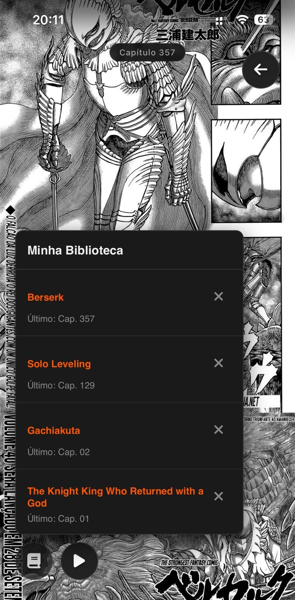

# Leitor Infinito de Mangá

Um userscript que transforma a experiência de leitura em sites de mangá, oferecendo rolagem infinita, histórico de leitura, rolagem automática e bloqueio de anúncios.

## Funcionalidades

- **Rolagem Infinita**: Carrega automaticamente o próximo capítulo enquanto você rola a página.
- **API Nativa**: Integração direta com a API REST do site — sem depender de seletores DOM frágeis.
- **Criptografia**: Descriptografa respostas da API automaticamente (CryptoJS Rabbit).
- **Bloqueio de Anúncios**: Bloqueia requisições para domínios de terceiros (fetch, XHR, sendBeacon), remove iframes e pop-ups maliciosos.
- **Rolagem Automática**: Ative com duas velocidades ajustáveis. Toque duplo no mobile para alternar.
- **Histórico de Leitura**: Salva o progresso localmente (localStorage). Botão de biblioteca com links diretos e exclusão.
- **Interface Minimalista**: Remove anúncios e poluição visual. Clique/toque em área vazia para ocultar/mostrar botões.
- **Atualização de URL**: A URL da barra de endereço é atualizada conforme você navega entre capítulos.
- **Navegação SPA**: Funciona com sites que usam History API (pushState/replaceState) sem recarregar a página.
- **Lazy Loading**: Imagens carregadas sob demanda com IntersectionObserver.
- **Compatível com Mobile**: Gestos de toque otimizados.

## Screenshots

### Desktop

### Mobile
<table>
  <tr>
    <td></td>
    <td></td>
  </tr>
</table>

## Instalação

### Desktop
1. Instale um gerenciador de userscripts:
   - [Tampermonkey](https://www.tampermonkey.net/) (recomendado)
   - [Violentmonkey](https://violentmonkey.github.io/) (alternativa moderna)
2. Baixe o arquivo `manga-reader.user.js` deste repositório.
3. Abra o arquivo no navegador ou arraste para o painel do gerenciador.
4. O script será ativado automaticamente nos sites configurados.

### Mobile (Android)

1. Firefox para Android + extensão Tampermonkey.
2. Baixe o arquivo `manga-reader.user.js` e instale via Tampermonkey.

### Mobile (iOS)

1. App [Userscripts](https://apps.apple.com/app/userscripts/id1463298887) (App Store).
2. Coloque o arquivo `manga-reader.user.js` na pasta do Userscripts.
3. Ative a extensão no Safari (Configurações > Safari > Extensões).

## Como Usar

### Desktop
- **Rolagem Infinita**: Apenas role a página para carregar o próximo capítulo.
- **Rolagem Automática**: Clique no botão "Play/Setas" (canto inferior esquerdo). Clique direito para alternar velocidade.
- **Histórico**: Botão "Livro" para abrir/fechar a biblioteca. Progresso salvo automaticamente.
- **Interface**: Clique em área vazia para ocultar/mostrar botões.

### Mobile
- **Rolagem Automática**: Toque no botão "Play/Setas". Toque duplo para alternar velocidade.
- **Histórico**: Toque no botão "Livro" para abrir/fechar a biblioteca.
- **Interface**: Toque em área vazia para ocultar/mostrar botões.

## Compatibilidade

- Navegadores desktop e mobile modernos.
- Requer JavaScript ativado.
- Gerencie com Tampermonkey, Violentmonkey ou Userscripts (iOS).

## Observações

- Dados salvos localmente no navegador (localStorage).
- O script usa a API REST do site com criptografia — sem scraping de DOM.
- Bloqueio de anúncios via override de fetch/XHR/sendBeacon + MutationObserver.
- Dependências: CryptoJS (CDN) e Font Awesome (CDN) para ícones.

## Licença

MIT. Veja o arquivo [LICENSE](LICENSE).
